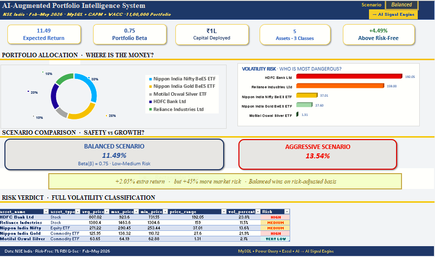
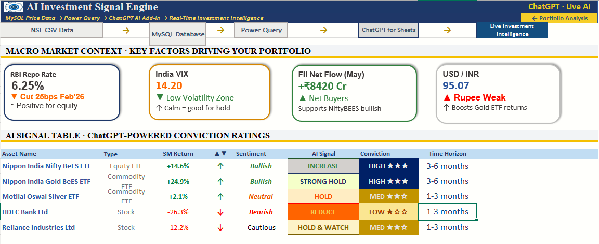
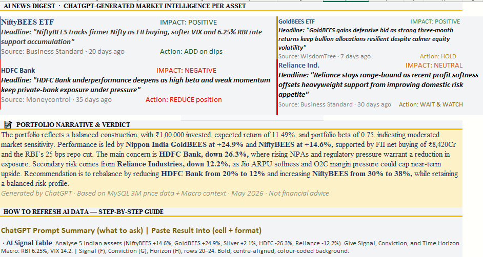
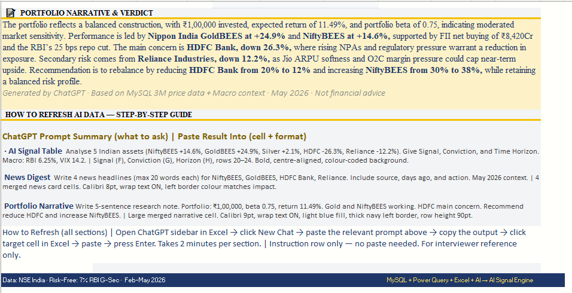
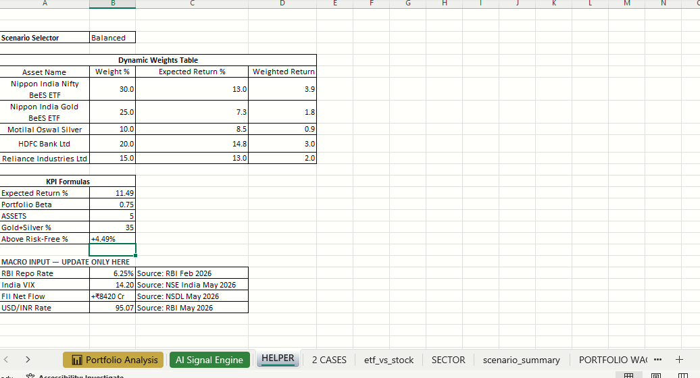
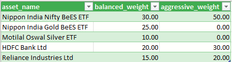
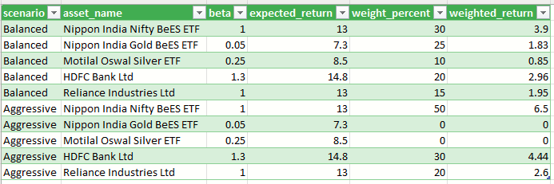

# 📊 AI-Augmented Portfolio Intelligence System
### [NSE India · Feb–May 2026 · ₹1,00,000 Portfolio](Portfolio_Intelligence_Dashboard.FINAL2.xlsx)


> ⚠️ Academic portfolio project. Not financial advice. Not connected to any brokerage.

---

## 🎯 The Question I Started With

> *"If you had ₹1,00,000 to invest across NSE assets — what would the data tell you to do?"*

Most dashboards show you numbers. I wanted to build a system that produces a **decision**.

That meant starting from zero — raw stock price files from NSE, a blank MySQL database, and a question. Everything you see in this project was built to answer that one question, step by step.

**Portfolio:** ₹1,00,000 · 5 Assets · 3 Asset Classes · Feb–May 2026

---

## 📸 Dashboard Preview

### Portfolio Analysis — Main Dashboard


### AI Signal Engine — ChatGPT-Powered Signals


### News Digest & Portfolio Narrative


### Portfolio Narrative & Rebalancing Verdict


### Helper Sheet — KPI Formulas & Macro Inputs


### Scenario Weights — Balanced vs Aggressive


### Portfolio Expected Returns


---

## 📖 The Story — What I Actually Built and Why

### Step 1 · Got the Raw Data
Downloaded 57 days of historical price data (Feb–May 2026) for 5 NSE assets directly from NSE India as CSV files. Five separate files, unstructured, no analysis yet.

### Step 2 · Built a MySQL Database
Instead of working directly in Excel, I first structured the data properly. Designed a `portfolio_intelligence` MySQL database with an `asset_summary` table — storing aggregated price statistics per asset: average price, max, min, price range, invested amount, and portfolio weight.

```sql
CREATE DATABASE portfolio_intelligence;
USE portfolio_intelligence;

CREATE TABLE asset_summary (
    asset_id       INT,
    asset_name     VARCHAR(100),
    asset_type     VARCHAR(50),
    sector         VARCHAR(50),
    avg_price      DECIMAL(10,2),
    max_price      DECIMAL(10,2),
    min_price      DECIMAL(10,2),
    avg_volume     BIGINT,
    total_days     INT,
    invested_amt   DECIMAL(10,2),
    weight_percent DECIMAL(5,2)
);
```

This gave me a clean, queryable foundation before any modelling.

### Step 3 · Connected MySQL to Excel via Power Query
Used Power Query (Get Data → From Database → MySQL) to pull the structured data directly into Excel. Applied transformations — removed nulls, standardised formats, computed `vol_percent = price_range / avg_price × 100`, and classified each asset's risk tier. Set it to auto-refresh, so the file stays live.

### Step 4 · Built the Financial Models
With clean data in Excel, I applied three core models:

**CAPM — Expected Return per Asset**
Expected Return = Rf + β × (Rm − Rf)
Rf = 7% (RBI G-Sec)  ·  Rm = NSE Nifty benchmark

**Weighted Portfolio Beta**
Portfolio β = Σ (Weight × Beta)  →  Result: 0.75

**Volatility Classification**

| Asset | Avg Price | Price Range | Vol % | Risk |
|---|---|---|---|---|
| HDFC Bank Ltd | ₹807 | ₹192 | 23.8% | 🔴 HIGH |
| Gold BeES ETF | ₹126 | ₹27.6 | 21.9% | 🔴 HIGH |
| Nifty BeES ETF | ₹271 | ₹37 | 13.6% | 🟡 MEDIUM |
| Reliance Ind. | ₹1380 | ₹159 | 11.5% | 🟡 MEDIUM |
| Silver ETF | ₹64 | ₹1.31 | 2.1% | 🟢 VERY LOW |

### Step 5 · Built Two Scenarios and Compared Them
This is where the real analysis happened. I constructed two allocation strategies and ran the models on both to see which one actually made more sense.

**The Core Question:** Does shifting more weight into high-beta stocks (Aggressive) justify the extra risk?

| | 🔵 Balanced | 🔴 Aggressive |
|---|---|---|
| NiftyBEES | 30% | 50% |
| Gold ETF | 25% | 0% |
| Silver ETF | 10% | 0% |
| HDFC Bank | 20% | 30% |
| Reliance | 15% | 20% |
| **Expected Return** | **11.49%** | **13.54%** |
| **Portfolio Beta** | **0.75** | **1.09** |
| **Verdict** | ✅ Wins risk-adjusted | ⚠️ +45% more market risk |

> The Aggressive scenario gains +2.05% more return — at the cost of 45% more market sensitivity.
> The Balanced portfolio wins on a risk-adjusted basis. That's not an opinion. That's what the model says.

### Step 6 · Added Macro Context
Before bringing in AI, I added four real macro indicators as context — because no model should ignore what's happening in the market:

| Indicator | Value | What It Meant |
|---|---|---|
| RBI Repo Rate | 6.25% | Cut 25bps Feb'26 — positive for equity |
| India VIX | 14.20 | Low volatility — calm market |
| FII Net Flow | +₹8,420 Cr | Net buyers — bullish for NiftyBEES |
| USD / INR | 95.07 | Rupee weak — boosts Gold ETF returns |

### Step 7 · AI Signal Engine (ChatGPT Add-in)
Used the ChatGPT for Excel Add-in with structured prompts to generate three intelligence outputs — not decorative, but built from the model's own numbers as input.

**AI Conviction Signals:**

| Asset | 3M Return | Signal | Conviction |
|---|---|---|---|
| NiftyBEES ETF | +14.6% | INCREASE | HIGH ★★★ |
| GoldBEES ETF | +24.9% | STRONG HOLD | HIGH ★★★ |
| Silver ETF | +2.1% | HOLD | MED ★★☆ |
| HDFC Bank | −26.3% | REDUCE | LOW ★☆☆ |
| Reliance Ind. | −12.2% | HOLD & WATCH | MED ★★☆ |

**AI Portfolio Verdict:**
> *"Recommendation: reduce HDFC Bank from 20% to 12% and increase NiftyBEES from 30% to 38%, while retaining a balanced risk profile."*
>
> *Generated by ChatGPT · Based on MySQL 3M price data + Macro context · May 2026 · Not financial advice*

---

## 🛠️ Skills Demonstrated

`MySQL` · `Power Query` · `CAPM` · `Portfolio Beta` · `Volatility Analysis` · `Scenario Modelling` · `WACC` · `Excel Dashboard Design` · `Financial Storytelling`

---

## 📁 Repository Files

| File | Description |
|---|---|
| `Portfolio_Intelligence_Dashboard.FINAL2.xlsx` | Full Excel workbook — 8 analytical sheets |
| `portfolio_queries.sql` | MySQL schema + INSERT statements |
| `NIFTYBEES-EQ-19-02-2026-19-05-2026.csv` | Raw NSE data — Nifty BeES ETF |
| `GOLDBEES-EQ-20-02-2026-20-05-2026.csv` | Raw NSE data — Gold BeES ETF |
| `MOGSEC-EQ-20-02-2026-20-05-2026.csv` | Raw NSE data — Silver ETF |
| `HDFCBANK-EQ-20-02-2026-20-05-2026.csv` | Raw NSE data — HDFC Bank |
| `RELIANCE-EQ-20-02-2026-20-05-2026.csv` | Raw NSE data — Reliance Industries |

---

## ▶️ How to Run

Open MySQL Workbench → run portfolio_queries.sql
Open Excel file → Data → Refresh All
For AI outputs → open ChatGPT Add-in sidebar →
use the prompts in "HOW TO REFRESH AI DATA" section
on the AI Signal Engine sheet


---

## 👤 Author

**Vibhuti Bhardwaj** — B.Com (Hons) · Financial Analytics · Data-Driven Decision Making

[](https://www.linkedin.com/in/vibhutibh007/)
[](https://github.com/VIBHUTIBHARDWAJ)

---
*Data: NSE India · Risk-Free: 7% RBI G-Sec · Period: Feb–May 2026*
*Stack: MySQL · Power Query · Microsoft Excel · ChatGPT AI Add-in*
